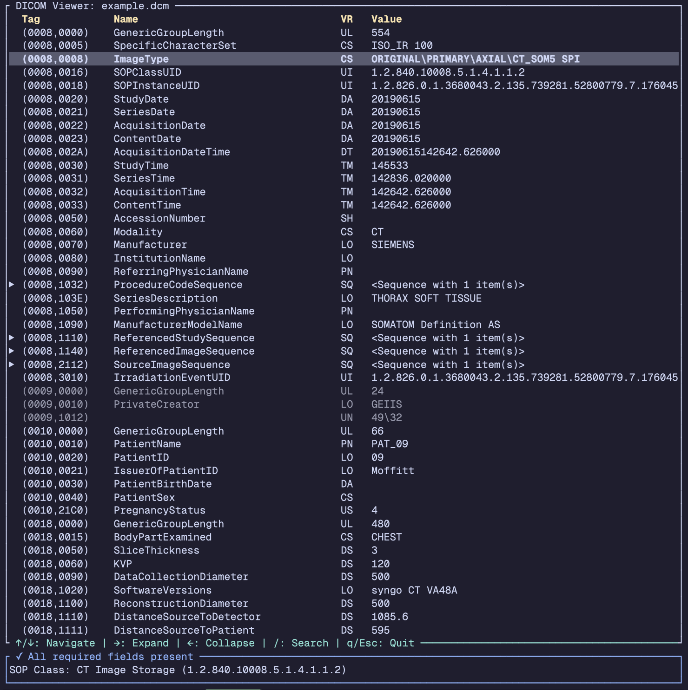

# dcr : DICOM Reader

DICOM TUI viewer for inspecting DICOM file tags in a terminal interface.



## Building

```
cargo install --path . 
```

## Usage

```
dcr <FILE>
```

Opens the specified DICOM file in the viewer.

## Controls

- Arrow keys or hjkl: Navigate
- Right arrow or l: Expand selected tag
- Left arrow or h: Collapse parent tag
- /: Search tags
- q or Esc: Close search/Quit

## Testing

Run the test suite:

```bash
cargo test
```

### Code Coverage

This project uses `cargo-llvm-cov` for coverage reporting.

```bash
# if not installed yet
cargo install cargo-llvm-cov

cargo llvm-cov 
```
